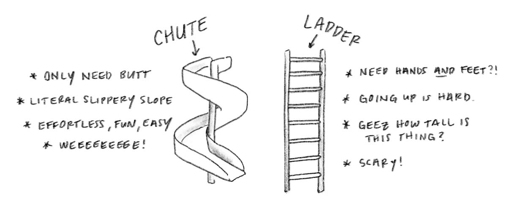

For as long as I've been doing social justice activism, we've operated within the paradigm of "Hearts and Minds." I'd love to see what happened if we switched to "Chutes and Ladders." Or even just had a foot in both worlds.

You've surely heard of "Hearts and Minds" activism. Even if not, you've definitely participated in it, whether on the changing or being changed side of things. It's so universal you might not have even thought of it as a _paradigm_ at all, but simply as "activism."

You've probably never heard of "Chutes and Ladders" activism, however, which is totally okay: I'm making it up right now. But maybe you've heard of the game -- or, better, played it yourself. In that case, you'll have a head start. In any case, I'm excited to explain what it is.

I'll start with that.

## What's "Chutes & Ladders" Activism?

C&L, as we'll call it, because I think this is such a good idea that it being indistinguishable from a local concrete company brand or law firm won't set it back, is easy to describe. 

Here's a definition:

> **Chutes & Ladders Activism** is the process of arranging some things in society to be easier (chutes) and other things in society to be more difficult (ladders), with the goal of making desirable things chutes, and undesirable things ladders.

Ladders slow you down, take energy and effort to climb, require hands _and_ feet, and if I've seen enough 90s movies to know that one misstep and the whole thing is falling backwards on you (scary!).

Chutes (slides), on the other hand are effortless, you only need a butt, are literal slippery slopes, effortless, easy, and fun (weeeeee!).

What kind of "things" are in play here? Everything!

Big picture stuff like policies, systems, and platforms can all be either chutes or ladders. And so can small picture stuff like individual's behaviors, actions, and decisions.

To make C&L more concrete (see what I did there?), let's pick an outcome we might want to see in social justice activism. For this example, we'll say that our goal is to have all vehicles on the road be carbon neutral.

A big picture chute could be a tax benefit to any vehicle manufacturer that makes their fleet of offerings carbon neutral (i.e., "green" electric vehicles, manufacturing, and so on) -- the bigger the benefit, the slippery-er the chute. 

A big picture ladder could be a tax added to the sale of any vehicle that wasn't carbon neutral, relative to the amount of carbon created by the manufacturing or use of that vehicle -- the more CO2 the vehicle produces, the higher the tax, the taller the ladder.

A small picture chute could be a local business installing electric charging stations in designated (and prime location) parking spots in their lot, rewarding customers who have electric vehicles, and attracting their business.

And so on. With those examples of different chutes and ladders, you can probably start to come up with your own.

What's important to highlight here is that, like the board game _Chutes and Ladders_, there are no dead ends. Landing on certain spaces jumps you forward, or gives you a boost. And landing on other squares sets you back. But both still represent a traversable path forward (even if some are more direct, and others are more roundabout). 

(In C&L activism, _unlike_ the board game, ladders are bummers, and chutes are where it's at. I'd like to think that, philosophically, this is also true in the board game, because more chutes means the longer the game lasts -- and if the game is fun don't you want to keep playing it?)

The easy part of transitioning to C&L is that we are already doing it, we're just not often cognizant of it. Or, rather, it's not the primary mechanism of the change we're trying to effect in society through our activism.

The tough part is going to be how deeply entrenched most of us are in the paradigm of "Hearts & Minds."

## By Comparison, What's "Hearts & Minds" Activism?

I'm happy to call it H&M (because, in addition it having the allure of a trendy, affordable clothing store, it has a lot of the similar problems), and let's start with a clear definition so we can contrast it against C&L:

> **Hearts & Minds Activism** is the process of changing what people think and how they feel about things in society, with the goal being that if they have the right knowledge or believe the right things, they'll act in support of our desired outcomes.

As I said earlier, this is so universal in activism as to not be considered _a_ mechanism of change, as much as we think about the best ways to operate this mechanism.

A lot of education (maybe most and close to all) within activism is about changing minds. "If they understand _this_, then we can get them to do or support _that_."

And a lot of the expression and inspiration within activism is about changing hearts. "Once they feel _this_, they'll inevitably do _that_."

The difference between the big picture changes we're hoping to make and the small picture is merely volume: enough small changes of hearts and minds eventually result in the big picture changing as well. Sometimes, however, we also take a more "top down" approach, and try to change the heart or mind of someone with a lot of power, and hope that [change will trickle-down](/trickle-down-social-justice).

The way we engage in H&M activism is similar to how we would hope a [happy!] virus might spread through a population: starting with viable hosts, then adapting and evolving as it infects everyone else. Hooray!

I probably don't need to provide you with examples of what H&M looks like, because pretty much any example of popular activism you're aware of will probably count. But to be thorough, I'll continue with the carbon neutral vehicles one from above.

A changing hearts example to get to the goal of all vehicles being carbon neutral on the road could be a PSA that depicts someone suffering from medical complications due to air pollution. Or photographs of cities cloaked in smog.

A changing minds example could be educating people about the overall economic savings of having a carbon neutral vehicle, if you factor in all the otherwise externalized costs of pollution, and the lifetime savings on fuel.

What's important to highlight about H&M, in contrast to C&L, is that we regularly hit roadblocks in trying to change people's hearts and minds. And these roadblocks (i.e., the people whose hearts or minds simply won't be changed) either stunt our progress, or force us to remove them so we can keep going forward (i.e., cutting people out of our lives, or not concerning ourselves with entire groups of people as being "changeable").

And this distinction is one of many that, I think, make a compelling case for more C&L, and less H&M.

## The Pitfalls of H&M

Right now, an unpaid digital intern working for H&M is getting a Google Alert that some "Sam Killermann blogger" is attacking their brand. Here's what I have to say to you: one, I'm not talking about you; two, seasonal colors are incredibly frustrating for someone who just wants to wear purple, all the time, regardless of the season.

Now that I got _that_ off my chest, let's take a tour of some of the major pitfalls of H&M -- or, shall I say, the _ladders_?

Hearts and Minds activism...

- **Leads us to focus on -ists, not -isms.** To accomplish the goals of social justice, we need to dismantle oppressive systems and create just ones. [Focusing on individual actors (the -ists) instead of systems (the -isms)](https://www.itspronouncedmetrosexual.com/2019/04/isms-not-ists/), can lead to scapegoating, be distracting, and will never be sufficient.
- **Reinforces the idea that (some) people are disposable.** Not willing to change your mind or heart? We don't need you. If you're not with us, you're against us.
- **Is susceptible to ["enemy of your enemy"](/enemy-of-your-enemy/) manipulations and distortions.** Our hearts and minds are both quite open to being mislead, and it's easy for us to lose the plot, or the overall goal, if we're simply hating what our enemy likes, or thinking the opposite of what they think.
- **Sets the bar almost impossibly high.** If we have to change _everyone's_ hearts and minds, it's totally understandable if we fail. It's [so ambitious, it's a good way to hide](/ambition-hiding/) from accountability.
- **Is moralizing, and creates [binaries of good and bad people.](https://www.itspronouncedmetrosexual.com/2019/03/binary-thinking/)** There are the people who get it, and those who don't. The people who care, and the heartless bastards.
- **Can translate into unhelpful or unintended policy.** Even when successful, and you effectively change someone's heart or mind to care about an issue how you care about it, that doesn't mean they'll see the next steps, or the solution, in the same way. In good cases, their solution is compatible with your goal. In bad cases, it's antithetical, or there wasn't a goal to begin with (beyond changing the heart or mind).
- **Fuels dogma.** Being resistant to questions, and appealing to absolute authority are byproducts of going full in on changing hearts and minds, because your own heart, and your own mind, must remain resolute.
- **Results in burnouts and backslides.** Caring is exhausting, sometimes we end up caring so much it breaks us. And our minds can keep being changed. We see this in sweeping policy trends. A trend in your favor might catch on this season, but a different trend might catch on next season -- one that just doesn't work for you.

Am I talking about clothes again? _Sorry I look terrible in mustard, H&M._

I cherry-picked these ladders because they all happen to be chutes of C&L activism. 

**The opposite of every item in that list is true for C&L:** it leads us to focus on -isms; it doesn't tell us people are disposable (but everyone is integral); it's not susceptible to "enemy of your enemy" traps; the bar is set achievably low (every chute and ladder are their own bar); it isn't moralizing; it's policy-focused; it's dogma resistant; and it's sustainable and any progress made is durable.

I'm not writing this to make a case for H&M, because, as I said earlier, I think we've already had that case made. (Our hearts and minds have been made up, I'm trying to change them.)

That said, there is one thing I want to acknowledge: the real superpower of H&M, and one thing that C&L doesn't do well (and I don't think can ever do well) is help us navigate ideological uncertainties, and explore situations where we're unsure of where we want to go. We can follow our hearts, or go deep down a rabbit hole of thought, and see where we end up. 

And that's something we need to be able to do, to create more opportunities to do, and it's not something I want to downplay the significance of.

By contrast, for C&L to work well, you need to be _sure_ you know where you are heading.

## It's All About Incentives

My idea for Chutes & Ladders was inspired by the writing and research of [Daniel Kahneman](https://www.goodreads.com/author/show/72401.Daniel_Kahneman). The beauty of C&L, to me, is that it forces us to think clearly and strategically about what incentives we are creating in society, and the downstream effects of those incentives.

In social justice, and in H&M activism broadly, the main incentives that show up are intrinsic, or altruistically motivated. Changing your mind about something and learning the truth, or expanding your perspective, is its own reward. And motivating people to change their hearts, to let something in to motivate them to feel a certain way, is often rooted in altruism: caring for another person, their well-being, and their happiness.

And we'll often use sticks, or punishments, to reinforce our H&M activism. If you _don't_ believe this, or think this, we'll make you regret it. Either socially, or legally, or a little bit of both.

C&L isn't about punishing people for doing the "wrong" thing, or outlawing behaviors in general, it's about aligning incentives with the types of things we want to see more of in society.

In C&L activism, it doesn't matter what a person, group, or organization thinks or believes, we are simply trying to motivate them to act in certain ways we deem beneficial. If we want to encourage a behavior, we make it easier to do it, and more beneficial for anyone who is doing it. The rewards are extrinsic, and C&L doesn't rely on altruism.

We make something that we want to see happen appealing, then reward as many barriers, costs, and risks associated with it as we can.

Conversely, if there's an action we don't want to see, we make it unappealing, or construct barriers, increase costs, or highlight risks associated with it.

## They're Complementary

I'm not saying we abolish H&M activism, and we don't need to for C&L to work. The great news is they actually play quite nicely, even symbiotically, with one another.

Getting people to support your proposed chute, or install a ladder you've designed, is a project of changing hearts and minds. 

And when people's minds or hearts are changed about a particular issue, the natural next step is identifying chutes and ladders you can implement.

Too much C&L and you might lose sight of where people are at mentally regarding an issue, what they're feeling in their hearts, and miss opportunities for healing or inadvertently create systems that do harm.

Too much H&M and you might start to feel aimless, full of urgency and pain and certainty and drive, but unsure of where to go, or what to do about any of it.

In the end, to accomplish our goals, and to move toward a world where we're living social justice, we'll need a good amount of both H&M _and_ C&L activism. 

Which means that right now, in a moment where we're neck deep in [social justice dogma](/what-is-social-justice-dogma/#definition), and so many of us feel overwhelmed with urgency but aimless about where to go, we need a hell of a lot more Chutes & Ladders.

Who's ready to play?